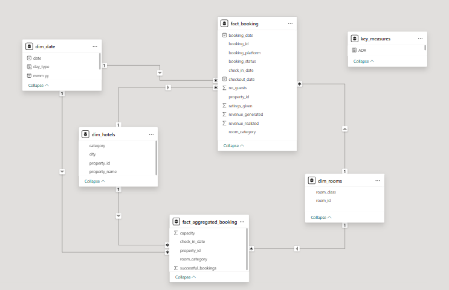

# Hotel Revenue Performance Analysis  

This project analyzes hotel revenue and booking performance across multiple cities and room types, providing actionable insights to optimize occupancy, pricing, and sales strategies.  

---

## 🚀 Project Highlights  
- Collected and transformed hotel booking & revenue data using **Power BI**  
- Created KPIs such as **Revenue, RevPAR, ADR, DSRN, Occupancy %, and Realisation %**  
- Built interactive dashboards with filters for **City** and **Room Type**  
- Analyzed **weekday vs weekend performance** and **cancellation trends**  
- Delivered insights into **top-performing properties**, **booking platforms**, and **revenue distribution by category (Luxury vs Business)**  

---

## 📈 Dashboard Features  
- KPI cards displaying **Revenue, RevPAR, ADR, DSRN, Occupancy %, Realisation %**  
- **Trend analysis** of ADR, RevPAR, and Occupancy % over time  
- **Pie chart** showing revenue distribution by hotel category  
- **Comparison of properties by key metrics** including cancellations and average ratings  
- **Booking platform analysis** showing impact on ADR and realisation %  

---

## 🛠️ Tools & Technologies  
- **Power BI** – Dashboarding, DAX calculations, Data modeling  
- **SQL** – Querying and extracting raw hotel booking data  
- **Excel** – Data preprocessing and validation  
- **Power Query** – ETL (Extract, Transform, Load) process in Power BI  
- **DAX (Data Analysis Expressions)** – KPI creation and calculated measures  
- **Database** – Hotel Bookings Database (*SQL Server / MySQL*)  
- **Data Visualization** – Interactive reports and drill-through analysis  

---

## 📊 Dataset Used 
- **dim_date**
- **dim_hotels**
- **dim_rooms**
- **fact_aggregated_bookings**
- **fact_bookings**

## 🗂️ Data Model (ERD / Relationships)  
The project uses a relational data model to connect different datasets (Bookings, Hotels, Revenue, Customers, etc.) in Power BI.  

  

